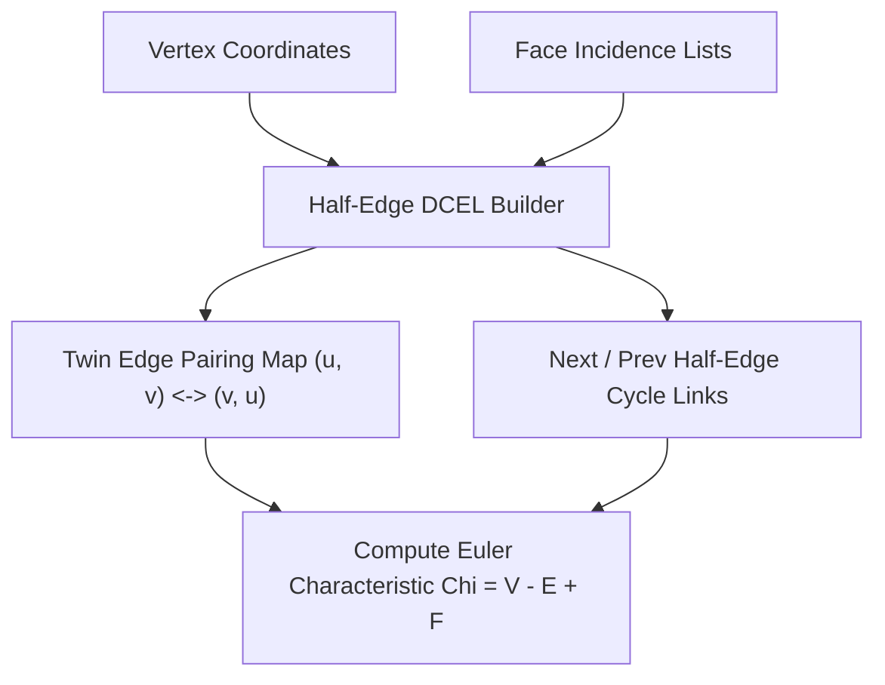

# genpark-half-edge-mesh-dcel-topology-skill

Agent Skill implementing the **Doubly Connected Edge List (DCEL)** Half-Edge topological mesh data structure for manifold mesh traversal, twin edge pairing, and Euler characteristic analysis.

## Architectural Overview

